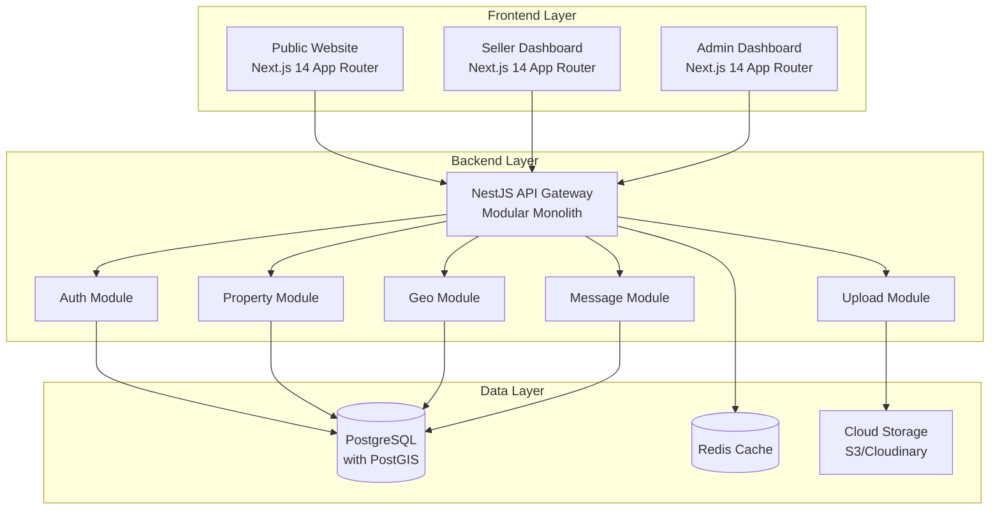

# Design Document: Real Estate Marketplace

## Overview

The Real Estate Marketplace is a modern, scalable platform built with a modular monolith architecture using NestJS for the backend and Next.js 14 with App Router for the frontend. The system supports three main interfaces: a public website for property search, a seller dashboard for property management, and an admin dashboard for system administration.

The architecture emphasizes type safety, performance optimization, and maintainability through modern TypeScript tooling, efficient database design with PostGIS for geographic operations, and optimized frontend rendering strategies.

## Architecture

### System Architecture



### Technology Stack

**Backend:**
- **Framework:** NestJS with TypeScript
- **Database:** PostgreSQL 15+ with PostGIS extension
- **ORM:** Prisma ORM for type-safe database operations
- **Caching:** Redis for session management and query caching
- **File Storage:** AWS S3 or Cloudinary for image management
- **Authentication:** JWT with refresh tokens
- **Containerization:** Docker for development and deployment

**Frontend:**
- **Framework:** Next.js 14+ with App Router
- **Language:** TypeScript with strict mode
- **Styling:** Tailwind CSS with Shadcn/UI components
- **State Management:** Zustand for global state, React Query for server state
- **Maps:** Leaflet with clustering for property visualization
- **Forms:** React Hook Form with Zod validation

## Components and Interfaces

### Database Schema (Prisma)

```prisma
// User management with role-based access
model User {
  id          String   @id @default(cuid())
  email       String   @unique
  password    String
  firstName   String
  lastName    String
  phone       String?
  avatar      String?
  role        UserRole @default(BUYER)
  isActive    Boolean  @default(true)
  createdAt   DateTime @default(now())
  updatedAt   DateTime @updatedAt

  // Relations
  properties     Property[]
  sentMessages   Message[] @relation("MessageSender")
  receivedMessages Message[] @relation("MessageReceiver")
  savedSearches  SavedSearch[]
  favorites      Favorite[]
  
  @@map("users")
}

enum UserRole {
  ADMIN
  AGENT
  INDIVIDUAL_SELLER
  BUYER
}

// Location hierarchy for geographic organization
model Location {
  id       String @id @default(cuid())
  name     String
  type     LocationType
  parentId String?
  parent   Location? @relation("LocationHierarchy", fields: [parentId], references: [id])
  children Location[] @relation("LocationHierarchy")
  
  // Relations
  properties Property[]
  
  @@map("locations")
}

enum LocationType {
  CITY
  DISTRICT
  NEIGHBORHOOD
}

// Core property model with geographic data
model Property {
  id          String        @id @default(cuid())
  title       String
  description String
  price       Decimal       @db.Decimal(12, 2)
  currency    String        @default("USD")
  
  // Geographic data
  latitude    Float
  longitude   Float
  address     String
  locationId  String
  location    Location      @relation(fields: [locationId], references: [id])
  
  // Property details stored as JSONB for flexibility
  details     Json          // rooms, bathrooms, area, etc.
  
  category    PropertyCategory
  status      PropertyStatus @default(DRAFT)
  
  // Ownership
  ownerId     String
  owner       User          @relation(fields: [ownerId], references: [id])
  
  // Timestamps
  createdAt   DateTime      @default(now())
  updatedAt   DateTime      @updatedAt
  publishedAt DateTime?
  
  // Relations
  images      PropertyImage[]
  features    PropertyFeature[]
  messages    Message[]
  favorites   Favorite[]
  
  // PostGIS spatial index
  @@index([latitude, longitude])
  @@map("properties")
}

enum PropertyCategory {
  APARTMENT
  HOUSE
  VILLA
  OFFICE
  COMMERCIAL
  LAND
}

enum PropertyStatus {
  DRAFT
  PUBLISHED
  SOLD
  RENTED
  INACTIVE
}

// Property images with cloud storage integration
model PropertyImage {
  id         String   @id @default(cuid())
  propertyId String
  property   Property @relation(fields: [propertyId], references: [id], onDelete: Cascade)
  
  url        String
  publicId   String   // For Cloudinary or S3 key
  alt        String?
  order      Int      @default(0)
  
  createdAt  DateTime @default(now())
  
  @@map("property_images")
}

// Property features with many-to-many relationship
model Feature {
  id          String    @id @default(cuid())
  name        String    @unique
  category    String    // interior, exterior, building
  icon        String?
  
  properties  PropertyFeature[]
  
  @@map("features")
}

model PropertyFeature {
  propertyId String
  featureId  String
  
  property   Property @relation(fields: [propertyId], references: [id], onDelete: Cascade)
  feature    Feature  @relation(fields: [featureId], references: [id], onDelete: Cascade)
  
  @@id([propertyId, featureId])
  @@map("property_features")
}

// Messaging system for buyer-seller communication
model Message {
  id         String   @id @default(cuid())
  content    String
  
  senderId   String
  sender     User     @relation("MessageSender", fields: [senderId], references: [id])
  
  receiverId String
  receiver   User     @relation("MessageReceiver", fields: [receiverId], references: [id])
  
  propertyId String
  property   Property @relation(fields: [propertyId], references: [id])
  
  isRead     Boolean  @default(false)
  createdAt  DateTime @default(now())
  
  @@map("messages")
}

// User preferences and saved searches
model SavedSearch {
  id        String   @id @default(cuid())
  name      String
  filters   Json     // Search criteria as JSON
  
  userId    String
  user      User     @relation(fields: [userId], references: [id], onDelete: Cascade)
  
  isActive  Boolean  @default(true)
  createdAt DateTime @default(now())
  updatedAt DateTime @updatedAt
  
  @@map("saved_searches")
}

model Favorite {
  userId     String
  propertyId String
  
  user       User     @relation(fields: [userId], references: [id], onDelete: Cascade)
  property   Property @relation(fields: [propertyId], references: [id], onDelete: Cascade)
  
  createdAt  DateTime @default(now())
  
  @@id([userId, propertyId])
  @@map("favorites")
}
```

### Backend Module Structure

```
src/
├── app.module.ts
├── main.ts
├── common/
│   ├── decorators/
│   ├── filters/
│   ├── guards/
│   ├── interceptors/
│   └── pipes/
├── config/
│   ├── database.config.ts
│   ├── jwt.config.ts
│   └── upload.config.ts
├── modules/
│   ├── auth/
│   │   ├── auth.controller.ts
│   │   ├── auth.service.ts
│   │   ├── auth.module.ts
│   │   ├── strategies/
│   │   │   ├── jwt.strategy.ts
│   │   │   └── refresh.strategy.ts
│   │   └── guards/
│   │       ├── jwt-auth.guard.ts
│   │       └── roles.guard.ts
│   ├── properties/
│   │   ├── properties.controller.ts
│   │   ├── properties.service.ts
│   │   ├── properties.module.ts
│   │   ├── dto/
│   │   │   ├── create-property.dto.ts
│   │   │   ├── update-property.dto.ts
│   │   │   └── property-filter.dto.ts
│   │   └── entities/
│   ├── geo/
│   │   ├── geo.controller.ts
│   │   ├── geo.service.ts
│   │   ├── geo.module.ts
│   │   └── dto/
│   ├── upload/
│   │   ├── upload.controller.ts
│   │   ├── upload.service.ts
│   │   ├── upload.module.ts
│   │   └── multer.config.ts
│   ├── messages/
│   │   ├── messages.controller.ts
│   │   ├── messages.service.ts
│   │   ├── messages.module.ts
│   │   └── messages.gateway.ts
│   └── users/
│       ├── users.controller.ts
│       ├── users.service.ts
│       ├── users.module.ts
│       └── dto/
└── prisma/
    ├── prisma.service.ts
    └── schema.prisma
```

### Frontend Structure (Next.js App Router)

```
app/
├── layout.tsx
├── page.tsx
├── globals.css
├── (public)/
│   ├── layout.tsx
│   ├── page.tsx
│   ├── properties/
│   │   ├── page.tsx
│   │   ├── [id]/
│   │   │   └── page.tsx
│   │   └── search/
│   │       └── page.tsx
│   └── contact/
│       └── page.tsx
├── dashboard/
│   ├── seller/
│   │   ├── layout.tsx
│   │   ├── page.tsx
│   │   ├── properties/
│   │   │   ├── page.tsx
│   │   │   ├── new/
│   │   │   │   └── page.tsx
│   │   │   └── [id]/
│   │   │       ├── page.tsx
│   │   │       └── edit/
│   │   │           └── page.tsx
│   │   ├── messages/
│   │   │   └── page.tsx
│   │   └── analytics/
│   │       └── page.tsx
│   └── admin/
│       ├── layout.tsx
│       ├── page.tsx
│       ├── users/
│       │   └── page.tsx
│       ├── properties/
│       │   └── page.tsx
│       └── system/
│           └── page.tsx
├── api/
│   └── auth/
│       └── [...nextauth]/
│           └── route.ts
└── components/
    ├── ui/
    ├── forms/
    ├── maps/
    ├── property/
    └── layout/
```

## Data Models

### Property Search Filter Model

```typescript
interface PropertyFilters {
  // Location filters
  locationId?: string;
  city?: string;
  district?: string;
  neighborhood?: string;
  
  // Geographic filters
  bounds?: {
    north: number;
    south: number;
    east: number;
    west: number;
  };
  radius?: {
    lat: number;
    lng: number;
    distance: number; // in kilometers
  };
  
  // Property filters
  category?: PropertyCategory[];
  priceMin?: number;
  priceMax?: number;
  rooms?: number[];
  bathrooms?: number[];
  areaMin?: number;
  areaMax?: number;
  features?: string[];
  
  // Sorting and pagination
  sortBy?: 'price' | 'date' | 'area' | 'distance';
  sortOrder?: 'asc' | 'desc';
  page?: number;
  limit?: number;
}
```

### Property Details JSONB Structure

```typescript
interface PropertyDetails {
  // Basic details
  rooms: number;
  bathrooms: number;
  area: number; // in square meters
  floor?: number;
  totalFloors?: number;
  
  // Building details
  buildYear?: number;
  renovationYear?: number;
  buildingType?: string;
  
  // Additional features
  balcony?: boolean;
  terrace?: boolean;
  garden?: boolean;
  parking?: {
    type: 'garage' | 'outdoor' | 'covered';
    spaces: number;
  };
  
  // Energy efficiency
  energyRating?: string;
  heatingType?: string;
  
  // Custom fields for flexibility
  [key: string]: any;
}
```

Now I'll use the prework tool to analyze the acceptance criteria before writing the correctness properties.

## Correctness Properties

*A property is a characteristic or behavior that should hold true across all valid executions of a system—essentially, a formal statement about what the system should do. Properties serve as the bridge between human-readable specifications and machine-verifiable correctness guarantees.*

Based on the requirements analysis, the following correctness properties must be validated through property-based testing:

### Authentication and Authorization Properties

**Property 1: User Registration Role Assignment**
*For any* valid user registration data with a specified role (Admin, Agent, Individual_Seller, or Buyer), the created user account should have exactly that role assigned.
**Validates: Requirements 1.1**

**Property 2: JWT Authentication Round Trip**
*For any* valid user credentials, successful authentication should produce JWT and refresh tokens that can be used to access protected resources.
**Validates: Requirements 1.2**

**Property 3: Role-Based Resource Access**
*For any* user with a specific role, they should only be able to access resources that are permitted for that role.
**Validates: Requirements 1.3**

**Property 4: Token Refresh Functionality**
*For any* expired JWT token with a valid refresh token, the system should generate a new valid JWT token.
**Validates: Requirements 1.4**

**Property 5: Seller-Only Listing Creation**
*For any* user attempting to create a property listing, the operation should succeed only if the user has Agent or Individual_Seller role.
**Validates: Requirements 1.5**

### Property Management Properties

**Property 6: Complete Property Data Storage**
*For any* property listing creation with all required fields (title, description, price, location coordinates, features, category, status), all data should be stored accurately in the database.
**Validates: Requirements 2.1**

**Property 7: Image Upload and Optimization**
*For any* valid image file uploaded for a property, the system should optimize it and store it with cloud storage integration.
**Validates: Requirements 2.2**

**Property 8: Property Update Audit Trail**
*For any* property update operation, the system should maintain version history and update the timestamp.
**Validates: Requirements 2.3**

**Property 9: Published Property Visibility**
*For any* property with status changed to "published", it should appear in public search results.
**Validates: Requirements 2.4**

**Property 10: Deactivated Property Invisibility**
*For any* property that is deactivated, it should not appear in public search results while preserving all data.
**Validates: Requirements 2.5**

### Location Management Properties

**Property 11: Location Hierarchy Integrity**
*For any* location in the system, it should maintain the three-level hierarchy: City > District > Neighborhood.
**Validates: Requirements 3.1**

**Property 12: Property-Location Association**
*For any* property created with location data, it should be correctly associated with a specific location in the hierarchy.
**Validates: Requirements 3.2**

**Property 13: Hierarchical Location Filtering**
*For any* location-based query at any hierarchy level (city, district, neighborhood), the system should return properties associated with that location and its children.
**Validates: Requirements 3.3**

**Property 14: Location Hierarchy Validation**
*For any* new location being added, it should only be accepted if it maintains valid hierarchical relationships.
**Validates: Requirements 3.4**

**Property 15: Coordinate Storage Validation**
*For any* property with geographic coordinates, the latitude should be between -90 and 90, and longitude should be between -180 and 180.
**Validates: Requirements 3.5**

### Search and Filtering Properties

**Property 16: Multi-Filter Search Accuracy**
*For any* combination of search filters (price range, room count, area, location, features), the results should match all specified criteria.
**Validates: Requirements 4.1, 4.2**

**Property 17: Geographic Proximity Search**
*For any* "near me" search with coordinates and radius, all returned properties should be within the specified distance.
**Validates: Requirements 4.3**

**Property 18: Search Result Pagination**
*For any* search query with pagination parameters, the system should return the correct subset of results with proper page boundaries.
**Validates: Requirements 4.4**

### Property Features Properties

**Property 19: Feature Catalog Integrity**
*For any* property feature in the system, it should be properly categorized as interior, exterior, or building amenity.
**Validates: Requirements 5.1, 5.5**

**Property 20: Property-Feature Association**
*For any* property with selected features, all features should be correctly associated through many-to-many relationships.
**Validates: Requirements 5.2**

**Property 21: Feature-Based Search Accuracy**
*For any* search query with selected features, all returned properties should contain all specified features.
**Validates: Requirements 5.3**

**Property 22: New Feature Availability**
*For any* newly added feature to the system, it should immediately become available for selection in property listings.
**Validates: Requirements 5.4**

### Messaging System Properties

**Property 23: Message Thread Creation**
*For any* buyer contacting a seller about a property, a unique message thread should be created between the parties for that property.
**Validates: Requirements 6.1**

**Property 24: Message Storage and Delivery**
*For any* message sent in a conversation, it should be stored with correct timestamps and delivered to the recipient.
**Validates: Requirements 6.2**

**Property 25: Conversation Access Control**
*For any* message thread, only the original participants should be able to access the conversation history.
**Validates: Requirements 6.3, 6.5**

**Property 26: Message Notification**
*For any* new message in a conversation, the recipient should receive appropriate notifications.
**Validates: Requirements 6.4**

### User Preferences Properties

**Property 27: Saved Search Persistence**
*For any* search criteria saved by a user, it should be retrievable and executable to produce consistent results.
**Validates: Requirements 7.1**

**Property 28: Search Match Notification**
*For any* new property that matches saved search criteria, the user should be notified.
**Validates: Requirements 7.2**

**Property 29: Favorites Management**
*For any* property favorited by a user, it should appear in their personal favorites list and be removable.
**Validates: Requirements 7.3**

**Property 30: Saved Search Modification**
*For any* saved search, users should be able to modify or delete the search criteria.
**Validates: Requirements 7.4**

**Property 31: Favorite Property Update Notification**
*For any* property in a user's favorites that gets updated, the user should be notified of the changes.
**Validates: Requirements 7.5**

### Image Management Properties

**Property 32: Image Format Processing**
*For any* uploaded image in supported formats, the system should accept and optimize it for web display.
**Validates: Requirements 8.1**

**Property 33: Cloud Storage Integration**
*For any* image uploaded to the system, it should be stored in cloud storage with proper metadata.
**Validates: Requirements 8.2**

**Property 34: Image Size Optimization**
*For any* property image displayed in different contexts, it should be served in the appropriate optimized size.
**Validates: Requirements 8.3**

**Property 35: Image Management Operations**
*For any* property with multiple images, sellers should be able to reorder, delete, and add new images.
**Validates: Requirements 8.4**

**Property 36: Image Validation Limits**
*For any* image upload attempt, the system should enforce size limits and quality standards.
**Validates: Requirements 8.5**

### Geographic Search Properties

**Property 37: PostGIS Query Accuracy**
*For any* geographic search query, PostGIS should return properties that accurately match the spatial criteria.
**Validates: Requirements 9.1**

**Property 38: Map Clustering Display**
*For any* search results displayed on a map, properties should be properly clustered based on zoom level and density.
**Validates: Requirements 9.2**

**Property 39: Radius Search Precision**
*For any* "near me" search with specified radius, all returned properties should be within the exact distance specified.
**Validates: Requirements 9.3**

**Property 40: Dynamic Map Updates**
*For any* change in map boundaries, the visible property markers should update to reflect only properties within the new bounds.
**Validates: Requirements 9.4**

**Property 41: Location Search Methods**
*For any* location search using either address or coordinates, the system should return equivalent results for the same geographic location.
**Validates: Requirements 9.5**

### Multi-Step Form Properties

**Property 42: Form Step Progression**
*For any* property creation process, users should progress through all required steps: basic info, location, features, images, and review.
**Validates: Requirements 10.1**

**Property 43: Step Validation Enforcement**
*For any* form step with invalid data, the system should prevent progression to the next step.
**Validates: Requirements 10.2**

**Property 44: Form Data Persistence**
*For any* multi-step form navigation, previously entered data should be preserved when users navigate back.
**Validates: Requirements 10.3**

**Property 45: Draft Data Recovery**
*For any* interrupted property creation process, users should be able to resume from saved draft data.
**Validates: Requirements 10.4**

**Property 46: Form Completion Property Creation**
*For any* completed multi-step property form, a valid property listing should be created and made available.
**Validates: Requirements 10.5**

### Analytics Properties

**Property 47: Dashboard Statistics Accuracy**
*For any* seller dashboard access, the displayed statistics (views, inquiries, favorites) should accurately reflect actual property interactions.
**Validates: Requirements 11.1**

**Property 48: Time-Based Analytics**
*For any* analytics query with time period filters (daily, weekly, monthly), the data should be correctly aggregated for the specified period.
**Validates: Requirements 11.2**

**Property 49: Engagement Metrics Tracking**
*For any* property interaction (view, inquiry, favorite), the system should accurately track and aggregate the engagement metrics.
**Validates: Requirements 11.3**

**Property 50: Property Performance Comparison**
*For any* set of properties being compared, the system should provide accurate relative performance metrics.
**Validates: Requirements 11.4**

**Property 51: Performance-Based Insights**
*For any* property with sufficient interaction data, the system should generate relevant insights and recommendations.
**Validates: Requirements 11.5**

### Admin Management Properties

**Property 52: Admin User Management**
*For any* admin operation on user accounts (view, edit, suspend, delete), the operation should be executed correctly with proper authorization.
**Validates: Requirements 12.1**

**Property 53: Content Moderation Actions**
*For any* admin moderation action on property listings (approve, reject, flag), the property status should be updated accordingly.
**Validates: Requirements 12.2**

**Property 54: System Analytics Accuracy**
*For any* system metrics query, the analytics should accurately reflect actual platform usage data.
**Validates: Requirements 12.3**

**Property 55: Location Hierarchy Management**
*For any* admin operation on location hierarchy (add, edit, remove), the hierarchical relationships should remain valid.
**Validates: Requirements 12.4**

**Property 56: Administrative Audit Logging**
*For any* administrative action performed, it should be logged with timestamp, admin user, and action details.
**Validates: Requirements 12.5**

## Error Handling

### Error Categories

**Authentication Errors:**
- Invalid credentials should return 401 Unauthorized
- Expired tokens should trigger automatic refresh or return 401
- Insufficient permissions should return 403 Forbidden
- Malformed tokens should return 400 Bad Request

**Validation Errors:**
- Invalid property data should return 400 Bad Request with detailed field errors
- Invalid geographic coordinates should be rejected with specific error messages
- Image upload errors should specify file format or size issues
- Form validation should provide field-specific error messages

**Geographic Errors:**
- Invalid coordinates should return appropriate error messages
- PostGIS query failures should be handled gracefully
- Map service unavailability should fall back to text-based location display

**Database Errors:**
- Connection failures should be retried with exponential backoff
- Constraint violations should return user-friendly error messages
- Transaction failures should be rolled back completely

**External Service Errors:**
- Cloud storage failures should retry with fallback options
- Email service failures should queue notifications for retry
- Map service failures should degrade gracefully

### Error Recovery Strategies

**Graceful Degradation:**
- Map functionality should fall back to list view if map services fail
- Image display should show placeholders if cloud storage is unavailable
- Search should work with basic filters if advanced features fail

**Retry Mechanisms:**
- Network requests should implement exponential backoff
- File uploads should support resumable uploads
- Database operations should retry transient failures

**User Experience:**
- Error messages should be user-friendly and actionable
- Loading states should indicate progress and potential delays
- Offline functionality should cache essential data

## Testing Strategy

### Dual Testing Approach

The system will employ both unit testing and property-based testing to ensure comprehensive coverage:

**Unit Tests:**
- Test specific examples and edge cases
- Validate integration points between modules
- Test error conditions and boundary values
- Focus on concrete scenarios and known use cases

**Property-Based Tests:**
- Validate universal properties across all inputs
- Use randomized input generation for comprehensive coverage
- Test invariants and mathematical properties
- Ensure correctness across the entire input space

### Property-Based Testing Configuration

**Framework:** fast-check for TypeScript/JavaScript property-based testing
**Test Iterations:** Minimum 100 iterations per property test
**Test Organization:** Each property test must reference its design document property
**Tag Format:** **Feature: real-estate-marketplace, Property {number}: {property_text}**

### Testing Implementation Strategy

**Backend Testing (NestJS):**
- Unit tests using Jest for services and controllers
- Property tests using fast-check for business logic validation
- Integration tests for database operations and external services
- E2E tests for complete API workflows

**Frontend Testing (Next.js):**
- Component tests using React Testing Library
- Property tests for form validation and state management
- Integration tests for API interactions
- Visual regression tests for UI components

**Database Testing:**
- Property tests for PostGIS geographic queries
- Unit tests for Prisma schema validation
- Performance tests for complex queries
- Data integrity tests for relationships

### Test Data Management

**Property Test Generators:**
- User data generators for different roles and scenarios
- Property data generators with valid geographic coordinates
- Image file generators for upload testing
- Search filter generators for comprehensive query testing

**Test Database:**
- Isolated test database for each test suite
- Seed data for consistent test scenarios
- Cleanup procedures for test isolation
- Performance benchmarks for query optimization